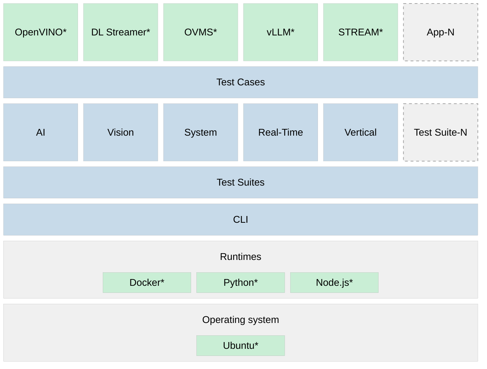

# Getting Started

Intel® ESQ runs on a range of supported platforms with discrete GPU and NPU accelerators. The architecture adapts to the available hardware, exercising compute resources through a structured stack of runtimes, test suites, and application-level workloads.

The following table describes each component in the stack, from the application layer down to the operating system foundation.

| Layer | Description |
|-------|-------------|
| **Applications and Components** | Workloads and services exercised by test cases — OpenVINO™ toolkit, Intel® DL Streamer*, OVMS*, vLLM*, and custom applications |
| **Test Cases** | Individual parameterized test cases within each suite, each targeting a specific workload or use case |
| **Test Suites** | Domain-specific test suites — AI, Vision, System, Real-Time, Vertical, and extensible custom suite types |
| **CLI** | Intel® ESQ command-line interface — the primary entry point for running tests, managing profiles, and viewing results |
| **Runtimes** | Docker*, Python*, and Node.js* runtime environments required for test execution and containerized workloads |
| **Operating System** | Ubuntu* as the supported base Linux* distribution |

## Next Steps

1. **[Quick Start](quick-start.md)** – Install dependencies and run all tests.

## Need Help?

If you encounter issues during setup:

1. Refer to the [Optimization](../guides/optimization.md) guide.
2. Check the [Troubleshooting](../guides/troubleshooting.md) guide.
3. Visit [GitHub* Issues](https://github.com/open-edge-platform/edge-system-qualification/issues) for community support.

---
