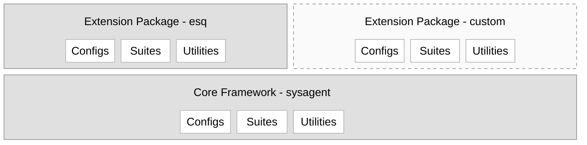
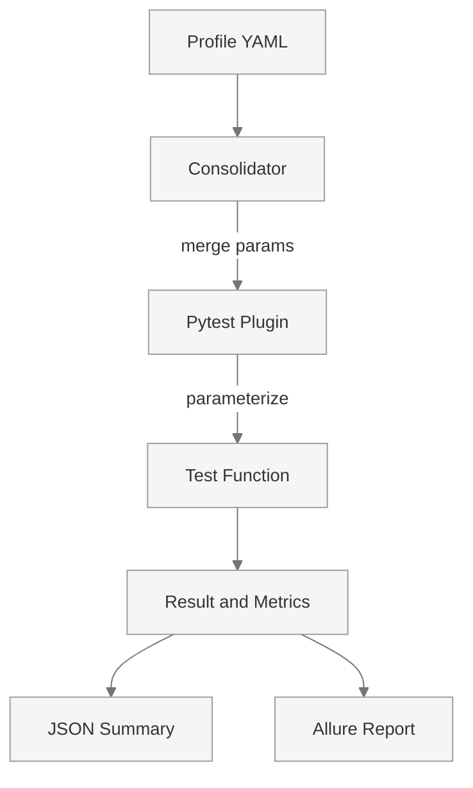

# Developer Guide

Comprehensive guide for developers integrating their own pytest tests into the Intel® ESQ framework.

---

## Overview

The Intel® ESQ framework provides a comprehensive pytest-based testing infrastructure with:

- **Automatic test parameterization** from YAML configuration files
- **Built-in fixtures** for caching, validation, and reporting
- **System requirement validation** with reusable flags
- **KPI-based test validation** with flexible configuration
- **Asset management** for models, videos, and files
- **Allure reporting** with rich visualizations
- **Docker\* integration** for containerized tests
- **Modular telemetry** for automatic background collection of CPU, memory, power, GPU, and NPU metrics during test execution — enabled entirely through profile YAML, requiring no test code changes

This guide will help you integrate your own tests into this framework and leverage its powerful features.

---

## Development Setup

Before writing or modifying tests, set up the repository in editable mode. This differs from the standard user installation, which installs Intel® ESQ as a standalone tool.

### User Installation vs. Developer Installation

| | User Installation | Developer Installation |
|---|---|---|
| **Command** | `uv tool install` | `uv pip install -e .` |
| **Purpose** | Run qualification tests on an edge system | Develop, modify, and extend the framework |
| **Editable Source** | No — installed as a frozen package | Yes — source changes take effect immediately |
| **Virtual environment** | Managed automatically by `uv tool` | Manually created with `uv venv` |
| **Typical user** | System validator, end user | Framework developer, test author |

### User Installation (read-only)

End users install Intel® ESQ as a standalone CLI tool:

```bash
uv tool install --force --refresh git+https://github.com/open-edge-platform/edge-system-qualification.git@main
```

The `esq` command is available globally. The installed source is not intended to be modified.

### Developer Installation (editable)

Developers working on tests or framework code must install the project in editable mode so that local source changes are reflected immediately without reinstalling.

#### Prerequisites

- Python* 3.10 or newer
- [uv](https://docs.astral.sh/uv/) package manager

Install `uv` if not already present:

```bash
curl -LsSf https://astral.sh/uv/install.sh | sh && source $HOME/.local/bin/env
```

#### Setup

**1. Clone the repository:**

```bash
git clone https://github.com/open-edge-platform/edge-system-qualification.git
cd edge-system-qualification
```

**2. Create a virtual environment:**

```bash
uv venv
```

**3. Activate the virtual environment:**

```bash
source .venv/bin/activate
```

**4. Install both packages in editable mode:**

```bash
uv pip install -e .
```

This installs both the `sysagent` and `esq` packages from `src/` in editable mode. Any changes you make to source files under `src/` are immediately active — no reinstall needed.

**5. Verify the installation:**

```bash
esq --version
esq list
```

#### Updating After Dependency Changes

If `pyproject.toml` changes (e.g., new dependencies are added), re-run the install command:

```bash
uv pip install -e .
```

#### Deactivating the Environment

```bash
deactivate
```

!!! tip
    Run `esq list` after setup to confirm that profiles load correctly and the installation is complete.

!!! note
    The `uv tool install` approach used in the Quick Start guide is **not** suitable for development. It installs the package outside a project virtual environment and does not reflect local source edits.

---

## Framework Architecture

### Dual-Package Structure




The framework is split into two packages: `sysagent`, which provides the core infrastructure, and `esq`, which contains domain-specific test suites and configurations.

```
src/
├── sysagent/               # Core framework (reusable infrastructure)
│   ├── cli.py              # Main CLI entry point
│   ├── configs/            # Framework configurations
│   ├── suites/             # Core test suites (examples)
│   └── utils/
│       ├── cli/            # CLI command handlers
│       ├── plugins/        # Pytest fixtures and hooks
│       ├── core/           # Result, Metrics, Cache classes
│       ├── config/         # Configuration loaders
│       ├── testing/        # System validation utilities
│       ├── reporting/      # Allure and chart generation
│       └── infrastructure/ # Docker*, Node.js* setup
│
├── esq/                    # ESQ package (domain-specific tests)
│   ├── configs/            # ESQ configurations
│   │   └── profiles/       # Test profiles (qualifications, suites, verticals)
│   ├── suites/             # Domain-specific test suites
│   │   ├── ai/             # AI tests (vision, audio, gen)
│   │   ├── media/          # Media processing tests
│   │   ├── system/         # System-level tests
│   │   └── vertical/       # Vertical-specific tests
│   └── utils/              # ESQ-specific utilities
│
└── your_package/           # Custom extension package (optional)
    ├── configs/            # Custom test profiles
    ├── suites/             # Custom test suites
    └── utils/              # Custom utilities
```

### Component Overview

| Component | Location | Purpose |
|-----------|----------|---------|
| CLI entry point | `src/sysagent/cli.py` | Main `esq` command |
| Pytest plugins | `src/sysagent/utils/plugins/` | Fixtures, hooks, parameterization |
| Core abstractions | `src/sysagent/utils/core/` | `Result`, `Metrics`, `Cache` classes |
| Config loaders | `src/sysagent/utils/config/` | YAML profile loading |
| System validation | `src/sysagent/utils/testing/` | Requirements checking |
| Reporting | `src/sysagent/utils/reporting/` | Allure and chart generation |
| AI test suites | `src/esq/suites/ai/` | Vision, audio, generative AI tests |
| Media test suites | `src/esq/suites/media/` | Media processing tests |
| Test profiles | `src/esq/configs/profiles/` | YAML test plans |

### Test Discovery Flow



The framework reads YAML test keys (e.g., `test_dlstreamer`) and locates the corresponding `test_dlstreamer.py` file in the declared suite path. All merged profile parameters are passed to the test function through the `configs` fixture.

---

## In this Section

| Page | Description |
|------|-------------|
| [Writing Tests](writing-tests.md) | Step-by-step guide to creating tests and the 7-step execution pattern |
| [Profile & Test Config](configuration.md) | Profile YAML structure and `config.yml` KPI definitions |
| [System Requirements](requirements.md) | All available hardware and software requirement flags |
| [Fixtures Reference](fixtures.md) | Complete reference for all built-in pytest fixtures |
| [Results & Metrics](results-metrics.md) | `Result` and `Metrics` classes and how to use them |
| [KPI Validation](kpi-validation.md) | Defining and validating KPI thresholds |
| [Asset Management](assets.md) | Managing models, videos, and file assets |
| [Modular Telemetry](telemetry.md) | Background metric collection during test execution |
| [Best Practices & Advanced Topics](advanced.md) | Design guidelines, multi-device testing, Docker*, profile inheritance |
| [Allure Report Customization](allure-reports.md) | Customizing the bundled Allure3 report UI |
